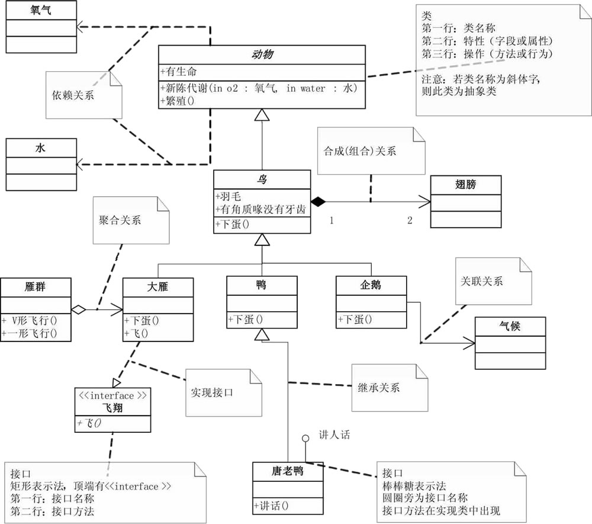

## 类关系记忆技巧

类关系记忆技巧总结如下表所示。

|分类|箭头特征|记忆技巧|
|----|----|----|
|箭头方向|从子类指向父类|	1. 定义子类需要通过 extends 关键字指定父类 2. 子类一定是知道父类定义的，但父类并不知道子类的定义 3. 只有知道对方信息时才能指向对方 4. 箭头的方向是从子类指向父类|
|继承/实现|用线条连接两个类； 空心三角箭头表示继承或实现|实线表示继承，是is-a的关系，表示扩展，不虚，很结实 虚线表示实现，虚线代表“虚”无实体|
|关联/依赖|用线条连接两个类； 普通箭头表示关联或依赖|1. 虚线表示依赖关系：临时用一下，若即若离，虚无缥缈，若有若无 2. 表示一种使用关系，一个类需要借助另一个类来实现功能 3. 一般一个类将另一个类作为参数使用，或作为返回值 4. 实线表示关联关系：关系稳定，实打实的关系，“铁哥们” 5. 表示一个类对象和另一个类对象有关联 6. 通常一个类中有另一个类对象作为属性 |
|组合/聚合|用菱形表示：像一个盛东西的器皿（如盘子）|1. 聚合：空心菱形，代表空器皿里可以放很多相同的东西，聚集在一起（箭头方向所指的类） 2. 整体和局部的关系，两者有独立的生命周期，是 has-a 的关系 3. 弱关系，消极的词：弱-空 4. 组合：实心菱形，代表器皿里已经有实体结构的存在，生死与共 5. 整体与局部的关系，和聚合关系对比，关系更加强烈，两者具有相同的生命周期，contains-a 的关系 6. 强关系，积极的词；强-满 |

注意：UML 的标准类关系图中，没有实心箭头。有些 Java 编程的 IDE 自带类生成工具可能出现实心箭头，主要目的是降低理解难度。

下面用一个经典案例来加深和巩固对类图的理解。下图是对动物衍生关系描述的类图。这个图非常有技术含量也非常经典，大家可以好好理解一下。

