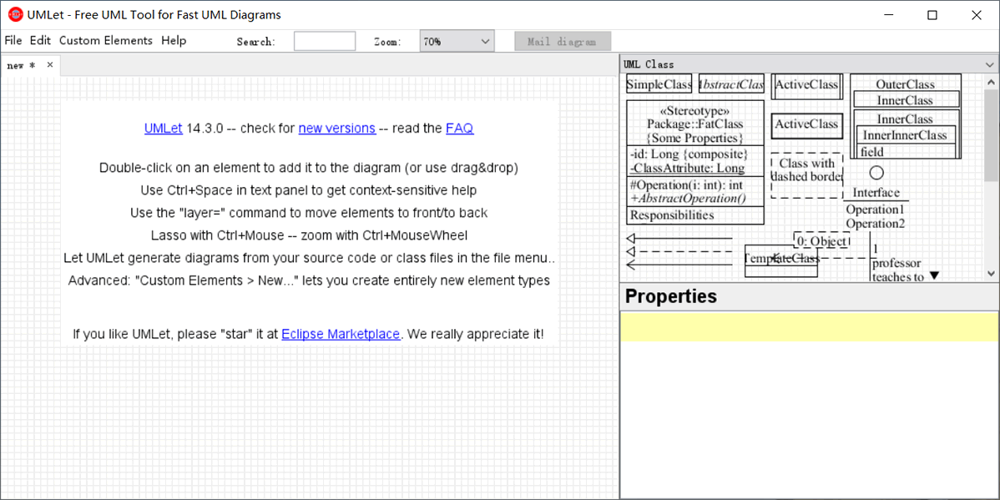
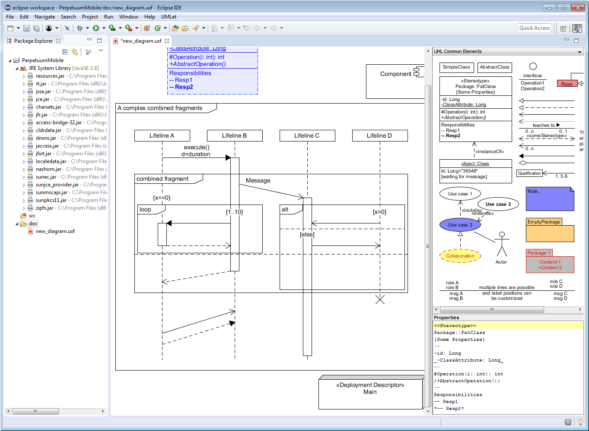
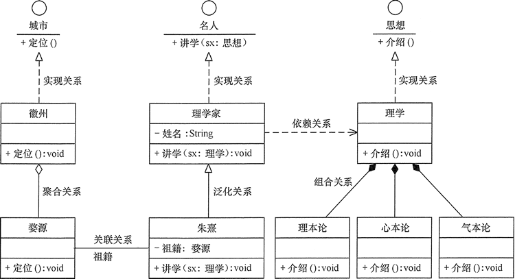

## UMLet的使用与类图的设计

本实验是为后续实验做准备的。在《设计模式》教程中，各个程序实例都要画类图，所以读者必须掌握用某种 UML 建模工具来画类图，本教程选择 UMLet 作为 UML 的建模工具。
### 实验目的
本实验的主要目的如下。
* 理解类的基本概念，掌握如何从需求分析中抽象出类的方法。
* 理解类之间关系，掌握如何分析具体实例中的类之间的关系。
* 掌握在 UMLet 中绘制类图的基本操作方法。

### 实验原理
在绘制类图之前，我们先来介绍一下 UMLet 工具。

### UMLet的使用
UMLet 是一款免费且开源的 UML 建模工具，它可以将原型导出为 bmp、eps、gif、jpg、pdf、png、svg 等格式，还可以集成到 Eclipse 中，作为 Eclipse 的插件在 Windows、Mac OS 和 Linux 等平台上运行。它可在 UMLet 官网下载安装。

用 UMLet 建模非常简单，方法如下：
* 首先打开 UMLet，然后在窗体右上侧区域内双击想要添加的对象，该对象将被自动添加到面板中；
* 再选中刚刚添加进来的对象，并在右下角的属性面板中修改该对象的属性；
* 最后保存创建完成的 UML 模型图，如果需要还可将结果导出为其他格式的文件。

如果要在 Eclipse 中安装 UMLet 插件，其方法如下。
* 下载相关版本的 UMLet 插件的压缩包，然后将解压的文件 com.umlet.plugin-14.3.jar 复制到 Eclipse 下的 plugins 目录下。
* 重启 Eclipse，选择“文件(F)” — 新建(N) ” — “其他(0)…” —“UMlet Diagram”，建立 UML 模型，如图所示。

UMLet 在 Eclipse 中的使用方法同前面介绍的一样。
### 实验内容
1. 通过《UML类图及类图之间的关系》一节的学习，在生活中找到相关实例。
2. 用 UMLet 工具对找到的相关实例中的类的关系建模。
### 实验要求
所设计的实验必须满足以下两点。
1. 类图中至少有一个类包含相关属性和方法，目的是掌握属性和方法的画法。
2. 所举的若干实例要包含前面介绍的 UML 类与类之间的 6 种关系，并正确画出其相互关系图。
### 实验步骤
1. 进行需求分析，从生活中提取出相关实例。
2. 分析以上实例，找到相关类并确定它们之间的关系，然后利用 UMLet 画出类以及类之间的关系图，图 3 以对理学家朱熹的介绍为例介绍类图的画法。
3. 整理实验结果，写出实验的心得体会。

